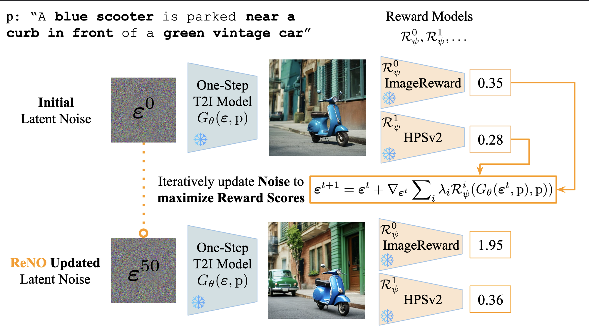

#  "ReNO: Enhancing One-step Text-to-Image Models through Reward-based Noise Optimization"

__Authors__: Luca Eyring*, Shyamgopal Karthik*, Karsten Roth, Alexey Dosovitskiy, Zeynep Akata

[](https://arxiv.org/abs/2406.04312v2) [](https://huggingface.co/spaces/fffiloni/ReNO)

### Abstract
Text-to-Image (T2I) models have made significant advancements in recent years, but they still struggle to accurately capture intricate details specified in complex compositional prompts. While fine-tuning T2I models with reward objectives has shown promise, it suffers from "reward hacking" and may not generalize well o unseen prompt distributions. In this work, we propose Reward-based Noise Optimization (ReNO), a novel approach that enhances T2I models at inference by optimizing the initial noise based on the signal from one or multiple human preference reward models. Remarkably, solving this optimization problem with gradient ascent for 50 iterations yields impressive results on four different one-step models across two competitive benchmarks, T2I-CompBench and GenEval. Within a computational budget of 20-50 seconds, ReNO-enhanced one-step models consistently surpass the performance of all current open-source Text-to-Image models. Extensive user studies demonstrate that our model is preferred nearly twice as often compared to the popular SDXL model and is on par with the proprietary Stable Diffusion 3 with 8B parameters. Moreover, given the same computational resources, a ReNO-optimized one-step model outperforms widely used open-source models such as SDXL and PixArt-α, highlighting the efficiency and effectiveness of ReNO in enhancing T2I model performance at inference time.




## Setup
First, install the necessary dependencies in `environment.yml`. Note that currently HPSv2 does not automatically download the OpenCLIP tokenizer, and you might have to manually download it as described [here](https://github.com/tgxs002/HPSv2/issues/30). If you want to use the Aesthetic predictor, place the [checkpoint](https://github.com/christophschuhmann/improved-aesthetic-predictor/raw/main/ava+logos-l14-linearMSE.pth) in `./ckpts/aesthetic_model.pth`.

Additionally, if you want to use [T2I-CompBench](https://github.com/Karine-Huang/T2I-CompBench/tree/main) or [GenEval](https://github.com/djghosh13/geneval/tree/main), you need to clone their respective repositories into the same parent directory as `ReNO`.

Lastly, for convenience the default output directory and cache directory can be set in `arguments.py` such that one does not need to pass them everytime.

## Usage
We provide five different settings `["single", "example-prompts", "t2i-compbench", "geneval", "parti-prompts"]`, which can be specified by the `task` argument. Here, we recommend to use the first two for testing `ReNO`, where `"single"` corresponds to a single generation and `"example-prompts"` generates images with ReNO for a small list of diverse prompts we provide in `assets/example_prompts.txt`, while the other three can be used to generate images for benchmarks and reproduce the results from the paper.

#### Testing
A basic command to generate one sample would be
```
python main.py  --task "single" --prompt "<prompt>" --model "<model>" --cache_dir "<cache_dir>" --save_dir "./outputs" --save_all_images
```
where the argument `save_all_images` enables the saving of images for every iteration of `ReNO` instead of just the best one.
Analgously, a call for `"example-prompts"` could look like the following:

```
python main.py  --task "example-prompts" --model "sdxl-turbo" --save_all_images
```

Currently, the one-step T2I models `["sd-turbo", "sdxl-turbo", "pixart", "hyper-sd"]` are supported. For `"hyper-sd"` we recommend to set the `lr` to `10`.
For full details, you can have a look at `arguments.py` for how to change settings and ReNO's parameters including different reward criterions and weightings. ImageReward typically is useful for improving the prompt-alignment, while increasing HPSv2 weighting should make the images more visually pleasing.

Note: HyperSDXL currently needs >40GB VRAM to run smoothly, we are updating its usage with fp16 [memsave](https://github.com/plutonium-239/memsave_torch) to fit within 40GB VRAM. Alternatively, enabling cpu offloading (line `106` in `models/utils`) and using only 3/4 rewards, e.g. disable CLIPScore, also fits within 40GB.

#### Reproducing Results
To reproduce the results from the paper, change the task to the corresponding settings and adjust the parameters as detailed in the paper. This will generate the images that can subsequently be used for evaluation. For example, one run could look like the following:

```
python main.py  --task "t2i-compbench" --prompt "color" --model "sd-turbo"
```

In `"t2i-compbench"`, the `prompt` argument determines for which of the six categories of T2I-CompBench to generate images. For GenEval, images need to be generated for 4 different seeds, which can be done like in the following:

```
python main.py  --task "geneval" --seed 2 --model "sdxl-turbo"
```
Then, the generated images for one prompt will be saved into the same folder such that they can directly be used for evaluation using GenEval. To evaluate the generated images either with [T2I-CompBench](https://github.com/Karine-Huang/T2I-CompBench/tree/main) or [GenEval](https://github.com/djghosh13/geneval/tree/main), please follow the instructions in their respective repositories including the installation of their dependencies. Additionally, the change in rewards will be saved for all experiments.

For the Parti-Prompts leave one reward out experiments, the leave one out reward should be disabled by e.g. `-no-enable_imagereward` and additionally we provide the argument `--benchmark_reward`, which determines the reward that will be analyzed and should be set to the left out reward.

### Sample Outputs


### Citation
```bibtex
@article{eyring2024reno,
  title={ReNO: Enhancing One-step Text-to-Image Models through Reward-based Noise Optimization}, 
  author={Luca Eyring and Shyamgopal Karthik and Karsten Roth and Alexey Dosovitskiy and Zeynep Akata},
  journal={Neural Information Processing Systems (NeurIPS)},
  year={2024}
}
```
